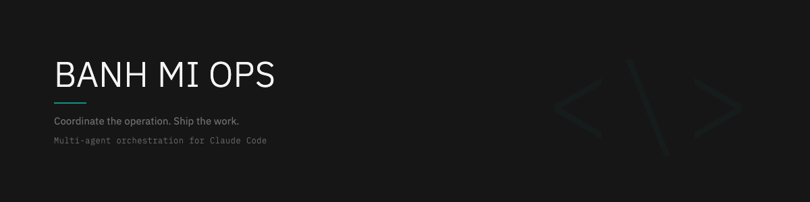
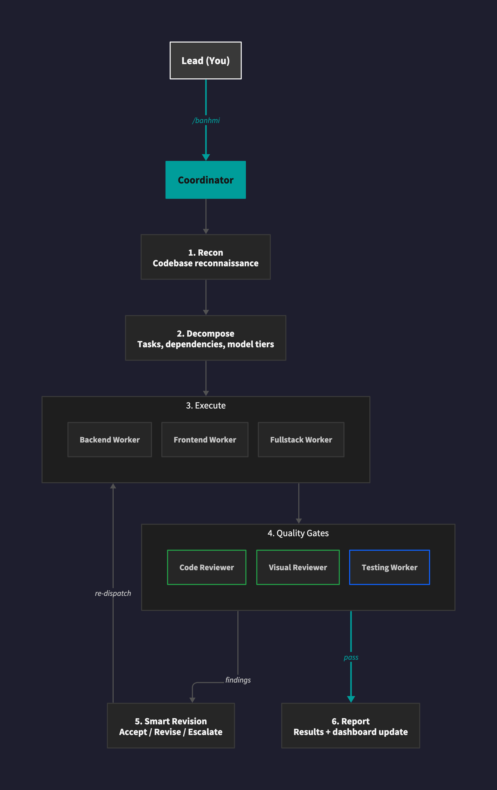
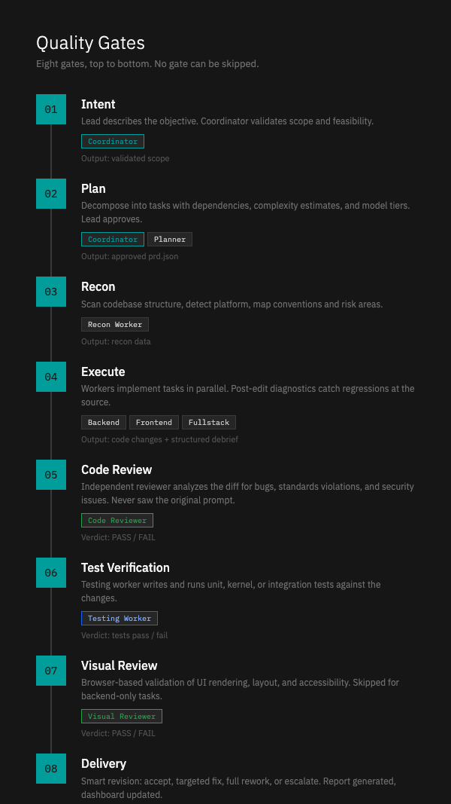
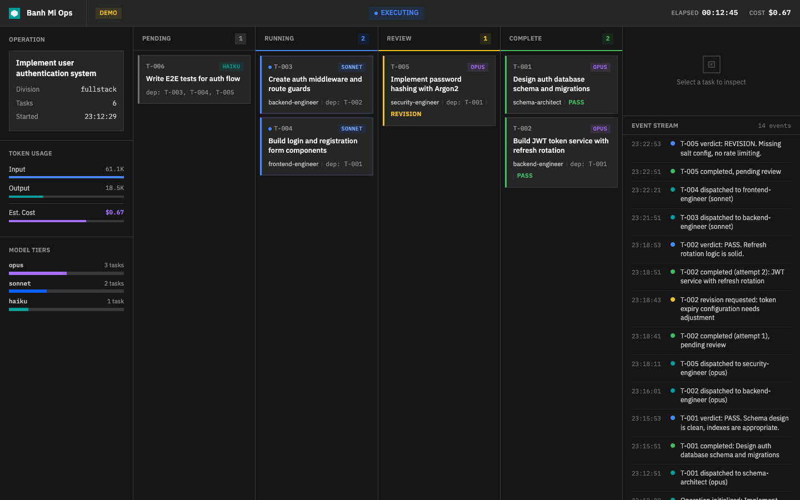

# Banh Mi Ops

**Multi-agent orchestration for Claude Code.**

I love banh mi. I also love the orchestration that goes into making one well. So I named my framework after it.

You describe a feature. Banh Mi Ops breaks it into a dependency graph of tasks, assigns each to a specialized agent with the right model tier, and dispatches them in parallel the moment their prerequisites complete. Every task output passes through three independent gates: static code review, automated test generation, and browser-based visual validation. Nothing ships without clearing all three.

What you get: a `prd.json` plan you approve before execution starts, per-task cost and token tracking, a live HTML dashboard showing pipeline status in real time, and a structured report when it finishes. You stay in control. The agents do the work.

The framework is built on principles that have worked for decades in other engineering disciplines:

**Separation of concerns.** Each agent has one job. Workers write code. Reviewers review it. The Coordinator orchestrates. No agent crosses its boundary. Same structure as a high-functioning engineering team: clear ownership, explicit interfaces.

**Dependency-driven execution.** Tasks dispatch the moment their prerequisites clear, not in rigid sequential waves. The critical path method that optimized construction scheduling in the 1950s now optimizes your feature builds. Parallelizable work runs in parallel.

**Independent verification.** Every task passes through reviewers that are structurally independent from the worker that wrote the code. The Code Reviewer never saw the implementation prompt. The Visual Reviewer validates against acceptance criteria, not intent. The same principle NASA uses for flight software.

**Quality at the source.** Workers run diagnostics after every edit and fix regressions before moving on. Defects caught at the point of introduction cost 10x less than defects caught downstream. Toyota figured this out in the 1980s. It applies to LLM-generated code too.

**Bounded revision.** Instead of unbounded retry loops, each task follows a structured protocol: accept, targeted fix, full rework, or escalate to a human. This prevents the infinite-loop failure mode that plagues autonomous agents and mirrors how circuit breakers work in distributed systems.

**Recon before commitment.** Every operation begins with a codebase scan that maps structure, conventions, and risk areas before any code is written. No agent operates blind.

<p align="center">
  
</p>

<p align="center">
  
</p>

---

## Table of Contents

- [Key Capabilities](#key-capabilities)
- [Quick Start](#quick-start)
- [Architecture](#architecture)
- [How It Works](#how-it-works)
- [Execution Modes](#execution-modes)
- [Team Packs](#division-packs)
- [Protocols](#protocols)
- [Terminology](#terminology)
- [Commands](#commands)
- [Documentation](#documentation)
- [Agent Teams](docs/AGENT_TEAMS.md)
- [Live Dashboard](docs/DASHBOARD.md)
- [Reporting](#reporting)
- [Uninstall](#uninstall)
- [Contributing](#contributing)
- [License](#license)

---

## Key Capabilities

- **Intelligence-first.** Every operation begins with a Sweep: a codebase reconnaissance scan that maps project structure, dependencies, conventions, and potential risks before any code is written.

- **Compounding knowledge.** Behavioral notes and SHA-anchored context accumulate across sessions. Each worker receives only the context it needs, keeping token budgets lean and outputs focused.

- **Tiered specialization.** Tasks are assigned to model tiers based on complexity. Routine scaffolding uses fast, cost-effective models. Architectural decisions and nuanced logic get the most capable tier.

- **Quality chain.** Every completed task passes through a Code Reviewer for static review and, where applicable, a Visual Reviewer for browser-based validation. Findings feed back into a Revision Cycle (up to two rounds) before the task closes.

- **Platform-aware.** Division packs bundle platform-specific workers, permissions, and protocols. A Drupal division knows about Drush, render arrays, and coding standards. A Generic division provides general-purpose backend, frontend, and fullstack workers. Divisions are modular and composable.

- **Dual execution modes.** Choose between Subagent Mode for focused operations (1-5 tasks) or Team Mode for large parallel work (6+ tasks) using Claude Code's native Agent Teams. The Coordinator coordinates both.

- **Live dashboard.** Open `scripts/dashboard.html` in a browser to see real-time operation progress: task dependency graph, worker status, cost tracking, and event stream. No server required.

- **Scalable.** New workers are just Markdown files with a system prompt. Drop one into the agents directory and it becomes available to the Coordinator. No plugin system, no compilation, no configuration files.

## Quick Start

### Prerequisites

- [Claude Code CLI](https://docs.anthropic.com/en/docs/claude-code) (latest version)
- Node.js 18+ (for report rendering)
- Git
- Bash (included on macOS and Linux; use Git Bash or WSL on Windows)
- [Playwright MCP](https://github.com/anthropics/anthropic-quickstarts/tree/main/mcp-server-playwright) (optional, for Visual Reviewer browser validation)

### Install

**1. Clone the repo:**

```bash
git clone https://github.com/nguyenab/banhmi-ops.git ~/banhmi-ops
```

**2. Install globally (all projects):**

```bash
bash ~/banhmi-ops/scripts/setup.sh --global
```

Or install to the current project only:

```bash
bash ~/banhmi-ops/scripts/setup.sh --local
```

Or both:

```bash
bash ~/banhmi-ops/scripts/setup.sh --both
```

To include a team pack (e.g., Drupal):

```bash
bash ~/banhmi-ops/scripts/setup.sh --global --team drupal
```

**3. Pre-authorize tools:**

```bash
bash ~/banhmi-ops/scripts/setup-permissions.sh --global
```

With team-specific permissions:

```bash
bash ~/banhmi-ops/scripts/setup-permissions.sh --global --team drupal
```

> **Windows users:** Run all commands in Git Bash or WSL. Native PowerShell is not supported.

### First Run

```bash
cd ~/your-project && claude
```

Then type:

```
/banhmi
```

The Coordinator will guide you through operation planning, task decomposition, and execution.

## Architecture

Banh Mi Ops is organized into three layers: skills (slash commands run in your main session), workers (subagents spawned for specific tasks), and scripts (shell and Node.js utilities for setup, permissions, and reporting).

### Skills (slash commands in your main session)

| File | Purpose |
|------|---------|
| `skills/banhmi/OPERATIONS_DIRECTOR.md` | Main entry point. Starts the operation wizard. |
| `skills/banhmi/OPERATION.md` | Operation execution and task lifecycle management. |
| `skills/banhmi/TESTING.md` | Testing workflow for operations. |
| `skills/sweep/SKILL.md` | Runs codebase reconnaissance and produces a context snapshot. |

### Workers (spawned as subagents)

| File | Division | Role | Model Tier |
|------|----------|------|------------|
| `agents/worker.md` | Core | General-purpose task execution worker | Highest |
| `agents/code-reviewer.md` | Core | Post-implementation static code review | Mid |
| `agents/visual-reviewer.md` | Core | Browser-based visual and functional validation | Mid |
| `agents/testing-worker.md` | Core | Test execution and validation | Mid |
| `agents/report-writer.md` | Core | Operation debrief and reporting | Mid |
| `agents/planner.md` | Core | Operation planning and task decomposition | Highest |
| `teams/generic/backend-worker.md` | Generic | General-purpose backend implementation | Highest |
| `teams/generic/frontend-worker.md` | Generic | General-purpose frontend implementation | Highest |
| `teams/generic/fullstack-worker.md` | Generic | General-purpose fullstack implementation | Highest |
| `teams/drupal/backend-worker.md` | Drupal | Drupal backend module and configuration tasks | Highest |
| `teams/drupal/frontend-worker.md` | Drupal | Drupal theming and frontend tasks | Highest |
| `teams/drupal/fullstack-worker.md` | Drupal | Drupal fullstack module, theme, and config tasks | Highest |

### Scripts

| File | Purpose |
|------|---------|
| `scripts/setup.sh` | Cross-platform installer |
| `scripts/setup-permissions.sh` | Pre-authorizes Claude Code tool permissions |
| `scripts/extract-tokens.sh` | Extracts token usage from session logs |
| `scripts/render-report.js` | Renders debrief JSON into an HTML report |
| `scripts/dashboard.html` | Live operation dashboard (self-contained, no server) |

## How It Works

### Operation Lifecycle

1. **Initiation.** The Lead (you) describes the feature or change needed. The Coordinator acknowledges and begins planning.

2. **Sweep.** A reconnaissance worker scans the codebase: file structure, dependencies, conventions, existing patterns, and potential conflict zones. The sweep output becomes shared context for all downstream workers.

3. **Decomposition.** The Coordinator breaks the feature into discrete tasks, each with a clear scope, acceptance criteria, and assigned worker.

4. **Execution.** Tasks are dispatched to workers. In Oversight Mode, each task is presented for Lead approval before execution. In Autonomous Mode, the full wave runs and results are presented at the end.

5. **Quality Chain.** Completed tasks pass through the Code Reviewer for review. If the task has a visual component, the Visual Reviewer validates in a browser. Findings are attached to the task record.

6. **Revision Cycle.** If reviewers flag issues, the task is re-dispatched with their findings. A maximum of two revision rounds prevents infinite loops.

7. **Debrief.** The Coordinator compiles the full operation record: tasks completed, analyst findings, token usage, and an overall assessment. This renders into an HTML report.

### Recon Sweep

The Sweep is the foundation of every operation. Before writing any code, a dedicated worker scans the project and produces a structured context snapshot covering:

- Project type and framework detection
- Directory structure and key file locations
- Dependency manifest (package.json, composer.json, etc.)
- Coding conventions observed in existing code
- Test infrastructure and coverage approach
- Potential risk areas relevant to the requested change

This snapshot is injected into every downstream worker's context, ensuring consistent awareness without redundant scanning.

### Quality Chain

The quality chain is a two-stage verification pipeline:

1. **Code Reviewer.** Reviews the diff for correctness, adherence to project conventions, security concerns, performance implications, and test coverage. Produces structured findings with severity levels.

2. **Visual Reviewer.** For tasks with UI impact, opens the result in a browser and validates layout, responsiveness, accessibility basics, and functional behavior. Captures observations as structured findings.

Both reviewers are independent workers with no knowledge of each other's results. Their findings merge into the task record and, if issues are found, trigger a Revision Cycle.

### Inter-Worker Delegation

The Coordinator delegates tasks using Claude Code's subagent spawning capability. Each worker receives:

- A system prompt defining its role and constraints
- The sweep context relevant to its task
- The specific task description and acceptance criteria
- Protocols (standing coding directives)

Workers do not communicate with each other directly. All coordination flows through the Coordinator, which maintains the operation state and routes information between stages.

## Execution Modes

| Mode | Behavior | Best For |
|------|----------|----------|
| **Oversight** | Coordinator presents each task for Lead approval before dispatching. Director can modify, skip, or reorder tasks. | Sensitive changes, unfamiliar codebases, learning the system |
| **Autonomous** | Coordinator executes the full task wave without pausing. Results and analyst findings are presented at the end. | Well-understood changes, trusted patterns, speed |

The Lead chooses the mode during operation planning and can switch mid-operation.

## Team Packs

Divisions are platform-specific bundles that include specialized workers, permissions, and protocol sections. They are installed alongside the core framework.

### Shipped Divisions

| Division | Contents |
|----------|----------|
| **Generic** | Backend, frontend, and fullstack workers for general-purpose projects. Always installed. |
| **Drupal** | Backend, frontend, and fullstack workers with knowledge of Drush, render arrays, configuration management, and Drupal coding standards. |

### Creating a Custom Team

1. Create a directory under `teams/your-division/`.
2. Add worker Markdown files directly in `teams/your-division/` (e.g., `backend-worker.md`, `frontend-worker.md`).
3. Add team-specific permissions to `setup-permissions.sh`.
4. Add team-specific protocols to `protocols.md`.
5. Install with `--team your-division`.

## Protocols

Protocols are standing coding directives loaded into every worker's context. They define the non-negotiable rules for code quality, style, and safety.

The default `protocols.md` includes sections for Universal rules, Drupal, and Generic projects. Customize it for your team by editing the file directly or maintaining a project-local override.

See [protocols.md](protocols.md) for the full directive set.

## Terminology

| Term | Meaning |
|------|---------|
| **Director** | The human user who initiates and oversees operations |
| **Coordinator** | The main Claude Code session that orchestrates everything |
| **Operation** | A feature or change request decomposed into tasks |
| **Task** | A single unit of work assigned to one worker |
| **Worker** | A subagent spawned to execute a specific task |
| **Division** | A team grouping by platform specialization (Drupal, React, etc.) |
| **Code Reviewer** | Post-implementation code reviewer worker |
| **Visual Reviewer** | Browser-based visual validation worker |
| **Sweep** | Codebase reconnaissance scan run before task execution |
| **Protocols** | Standing coding directives that all workers follow |
| **MES** | Banh Mi Event Stream, the NDJSON event backbone for operation tracking |
| **Oversight Mode** | Execution mode where the Lead reviews each task before dispatch |
| **Autonomous Mode** | Execution mode where all tasks run without pausing for approval |
| **Revision Cycle** | Re-dispatch of a task incorporating analyst findings (max 2 rounds) |

## Commands

| Command | What Happens |
|---------|-------------|
| `/banhmi` | Launches the operation wizard. Collects feature description, runs sweep, decomposes tasks, and begins execution. |
| `/sweep` | Runs a standalone codebase reconnaissance scan without starting a full operation. |
| `/debrief` | Generates the operation debrief report from the current session's event data. |
| `/status` | Displays current operation progress, task states, and any pending analyst findings. |

## Documentation

| Document | Content |
|----------|---------|
| [README.md](README.md) | This file. Project overview, architecture, and install instructions. |
| [USAGE.md](USAGE.md) | Detailed usage guide with wizard walkthrough, cheat sheet, and examples. |
| [protocols.md](protocols.md) | Standing coding directives for all workers. |
| [docs/AGENT_TEAMS.md](docs/AGENT_TEAMS.md) | Using Claude Code Agent Teams with Banh Mi Ops. |
| [docs/DASHBOARD.md](docs/DASHBOARD.md) | Live dashboard setup and state file schema. |
| [LICENSE](LICENSE) | MIT License. |

## Reporting

<p align="center">
  
</p>

Open `scripts/dashboard.html` in any browser to monitor operations in real time. No server required. See [docs/DASHBOARD.md](docs/DASHBOARD.md) for setup details.

After an operation completes, the debrief system produces a structured JSON record and renders it into a styled HTML report. The report includes:

- Operation summary and status
- Task-by-task breakdown with worker assignments and deliverables
- Token usage and model allocation
- Timeline of key events
- Analyst findings with severity levels
- Overall assessment

Generate a report:

```bash
node ~/.claude/scripts/render-report.js debrief.json report.html
```

Or from stdin:

```bash
cat debrief.json | node ~/.claude/scripts/render-report.js --stdin report.html
```

## Uninstall

Remove Banh Mi Ops files from your global Claude Code configuration:

```bash
bash ~/banhmi-ops/scripts/setup.sh --uninstall --global
```

Or from a local project:

```bash
bash ~/banhmi-ops/scripts/setup.sh --uninstall --local
```

## Contributing

Contributions are welcome. To add a new worker, create a Markdown file in `agents/` following the existing format. To add a new division, follow the structure in the Team Packs section above.

Please ensure all scripts work on macOS, Linux, and Windows (Git Bash / WSL) before submitting.

## License

MIT License. Built by [Abraham Nguyen](https://github.com/nguyenab). Powered by [Claude Code](https://docs.anthropic.com/en/docs/claude-code).
